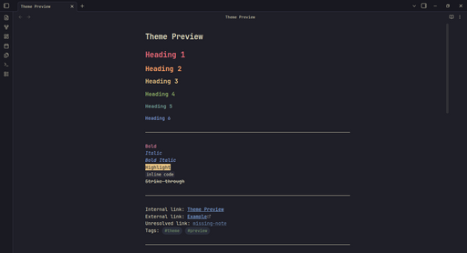
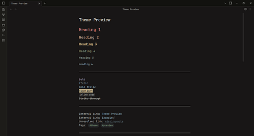
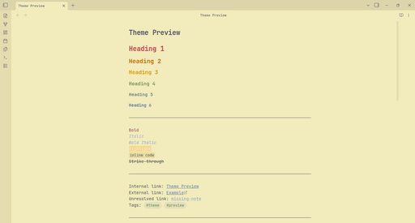

# Kanagawa Hokusai — Obsidian Theme

A faithful port of [rebelot/kanagawa.nvim](https://github.com/rebelot/kanagawa.nvim) for Obsidian. Three variants — Wave (dark), Dragon (dark alt), Lotus (light).

  
   
  <em>Wave (default dark)</em>

  
   
  <em>Dragon (dark alt)</em>

  
   
  <em>Lotus (light)</em>

## Variants

| Variant                 | Description                                      |
| ----------------------- | ------------------------------------------------ |
| **Wave** (default dark) | Deep ocean tones, warm dark, high contrast       |
| **Dragon**              | Late-night muted, warm brown-black, low contrast |
| **Lotus**               | Warm parchment-like light mode                   |

Switch between Wave and Dragon in dark mode via the [Style Settings](https://github.com/mgmeyers/obsidian-style-settings) plugin (Community → Style Settings).

## Installation

### From Obsidian (recommended once published)
1. Open Settings → Appearance → Themes
2. Click "Manage" and search for "Kanagawa Hokusai"
3. Install and activate

### Manual / Development
1. Clone or download this repo
2. Copy the folder to `{vault}/.obsidian/themes/Kanagawa Hokusai/`
3. Enable the theme in Settings → Appearance

## Features

- **3 full variants** — Wave, Dragon, Lotus — each with complete palette coverage
- **Style Settings integration** — switch dark variants, configure fonts
- **Faithful to source** — color mappings follow kanagawa.nvim's semantic schema

## Credits

- [rebelot](https://github.com/rebelot) — the original kanagawa.nvim theme

## License

MIT
